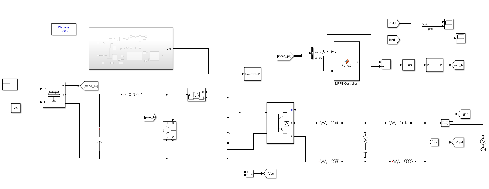
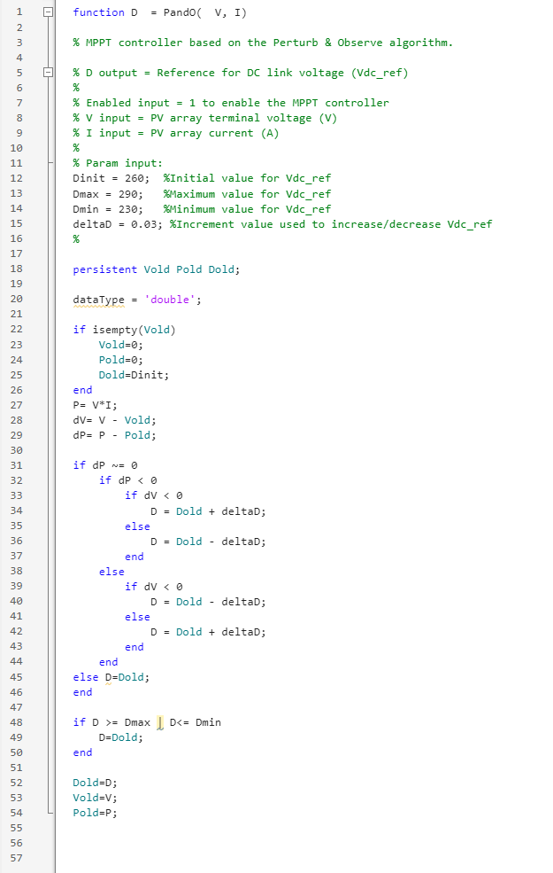
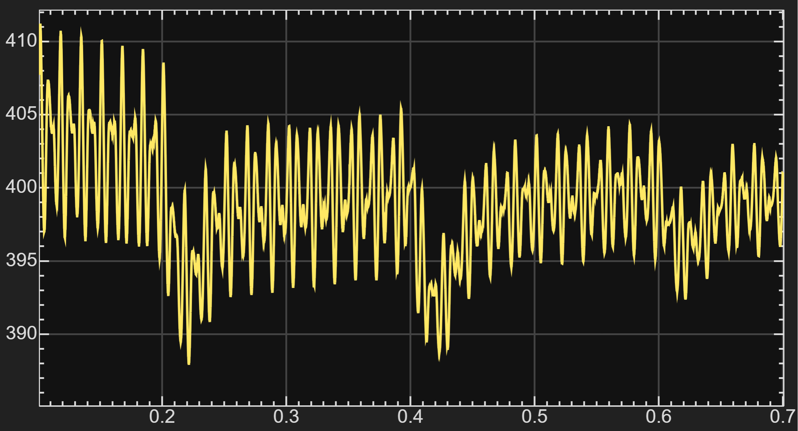
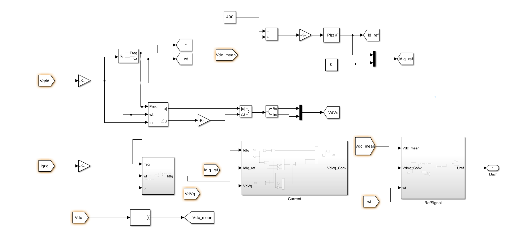
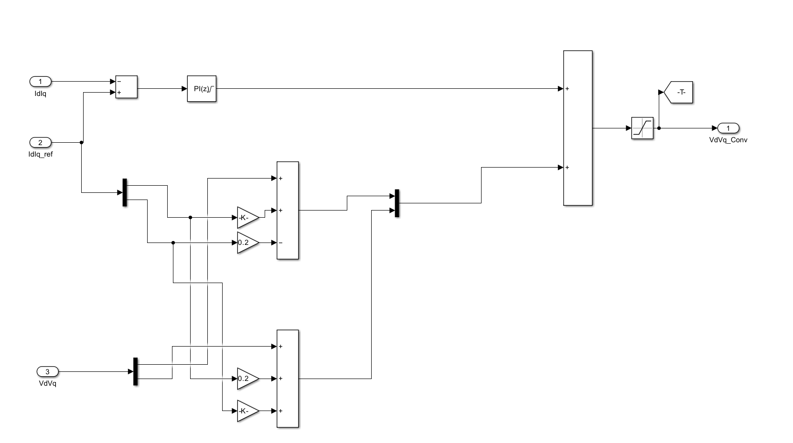
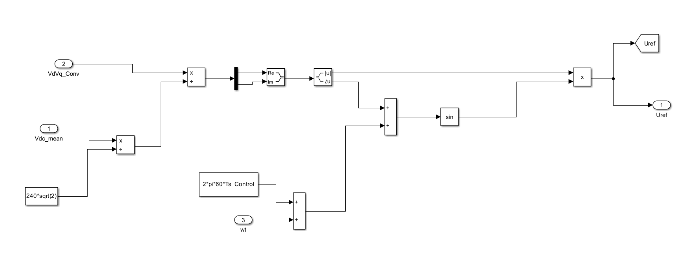
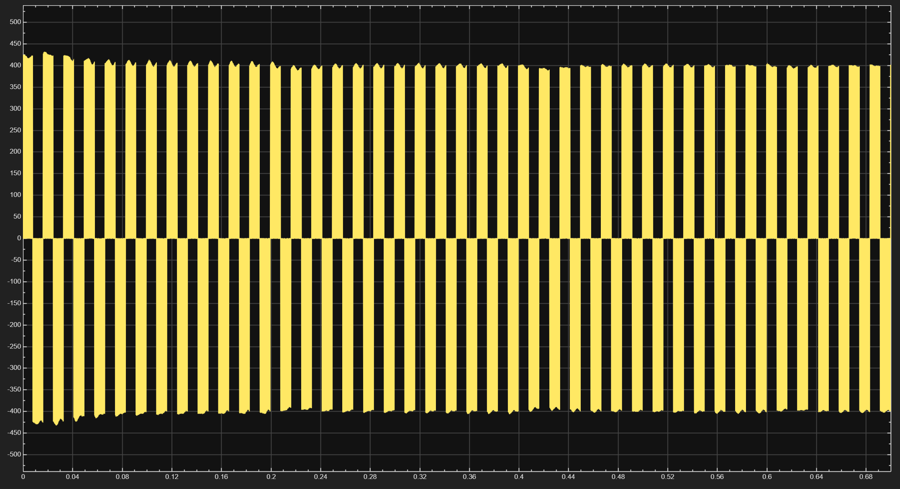
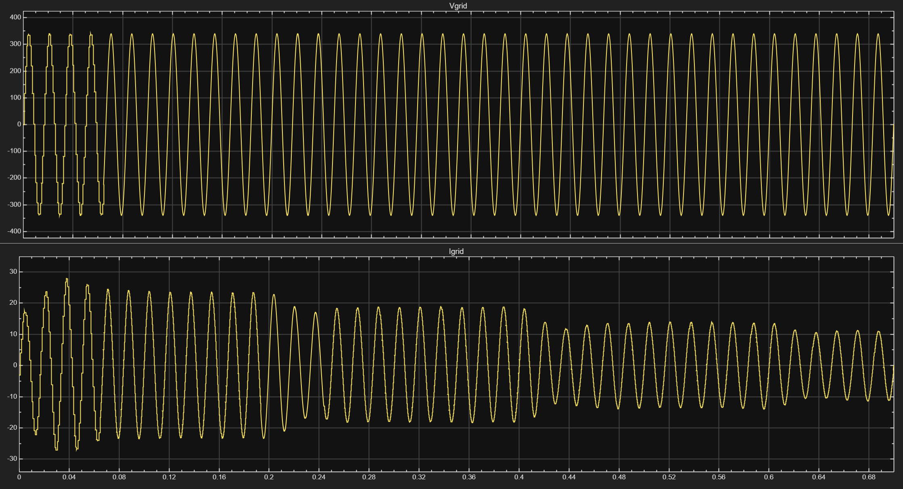

# Grid-Connected Solar PV System with MPPT

A MATLAB/Simulink simulation of a grid-connected solar photovoltaic system featuring a DC-DC boost converter, Perturb & Observe (P&O) maximum power point tracking, DC-link voltage regulation, single-phase inverter control, PWM generation, grid synchronization, dq-based current control, and an output filter.

The project models the complete energy-conversion path from the solar PV array to the utility grid while implementing the control systems required for MPPT operation and grid-connected inverter control.

---

## Project Overview

Grid-connected photovoltaic systems require several power-electronic and control stages to convert the DC power produced by a solar array into controlled AC power suitable for connection to the electrical grid.

This project was developed in MATLAB/Simulink to explore those stages in a complete simulation environment.

The model contains:

- Solar PV array
- PV voltage and current measurement
- DC-DC boost converter
- Perturb & Observe MPPT controller
- Boost-converter PI control
- DC-link capacitor and voltage measurement
- DC-link voltage regulation
- Grid synchronization
- Frequency and phase-angle estimation
- dq reference-frame transformations
- Inner current-control loop
- Reference-signal generation
- Two-level PWM generation
- Single-phase Universal Bridge inverter
- Grid-side filtering
- Grid voltage measurement
- Grid current measurement

The complete system can be summarized as:

```text
Solar Irradiance / Temperature
              ↓
          PV Array
              ↓
      DC-DC Boost Converter
              ↓
          DC-Link
              ↓
     Single-Phase Inverter
              ↓
         Output Filter
              ↓
        Utility Grid
```

The power stage is supported by two major control sections:

```text
PV-Side Control
PV Voltage + PV Current
        ↓
Perturb & Observe MPPT
        ↓
Boost Converter Control
```

and

```text
Grid-Side Control
Grid Voltage / Current
        ↓
Synchronization and dq Transformation
        ↓
DC-Link and Current Controllers
        ↓
Reference Signal Generation
        ↓
PWM
        ↓
Inverter Switching
```

---

## Full Simulink Model

The complete system model is shown below.



The left side contains the photovoltaic source and boost-converter stage.

The center section contains the DC-link and inverter.

The right side contains the grid-side filter, grid voltage/current measurements, and AC grid connection.

The upper control sections contain the MPPT controller, inverter-control subsystem, and PWM-generation logic.

---

## Solar PV Array

The PV array represents the DC energy source of the system.

The model uses solar irradiance and temperature as operating inputs.

The simulated operating conditions used in the model include:

```text
Irradiance = 1000 W/m²
Temperature = 25 °C
```

The PV measurement output provides the voltage and current signals required by the MPPT controller.

These signals are separated into:

```text
V_PV → PV terminal voltage
I_PV → PV terminal current
```

The instantaneous PV power can therefore be determined from:

```text
P_PV = V_PV × I_PV
```

These measurements are used by the Perturb & Observe algorithm to determine how the PV operating point should be adjusted.

---

## DC-DC Boost Converter

A DC-DC boost converter is placed between the PV array and the DC-link.

The boost-converter stage includes:

- Inductor
- Controlled switching device
- Diode
- DC-link capacitor
- PWM control signal

The purpose of this converter is to regulate the PV-side operating point while boosting the available PV voltage to the DC-link level required by the inverter.

The switching command for the boost converter is generated using the output of the MPPT-based control system.

A simplified signal path is:

```text
PV Array
   ↓
PV Voltage / Current
   ↓
P&O MPPT
   ↓
Reference Command
   ↓
PI Controller
   ↓
PWM Generation
   ↓
Boost Converter Switch
```

---

## Perturb & Observe MPPT

Maximum Power Point Tracking is implemented using the Perturb & Observe algorithm.



The P&O algorithm continuously evaluates the behavior of the PV array by observing changes in voltage and power.

The controller calculates:

```text
P = V × I
```

and compares the present operating point with the previous operating point.

The main quantities used by the algorithm are:

```text
dV = V - Vold
dP = P - Pold
```

where:

- `V` is the present PV voltage
- `Vold` is the previous PV voltage
- `P` is the present PV power
- `Pold` is the previous PV power

The controller then determines whether the operating reference should be increased or decreased.

Conceptually:

```text
Measure V and I
      ↓
Calculate PV Power
      ↓
Compare New Power with Previous Power
      ↓
Determine Direction of Change
      ↓
Increase or Decrease Reference
      ↓
Repeat
```

Persistent variables are used inside the MATLAB Function block to store previous values between simulation steps.

The implementation uses variables such as:

```matlab
persistent Vold Pold Dold
```

The MPPT controller therefore maintains knowledge of the previous operating point and uses that information to decide the next perturbation.

The reference is also constrained between minimum and maximum allowed values to prevent the controller from moving outside the intended operating range.

---

## MPPT Control Flow

The MPPT control sequence can be represented as:

```text
PV Voltage ──────┐
                 ├──→ P&O MPPT Algorithm
PV Current ──────┘
                         ↓
                   Reference Value
                         ↓
                     PI Control
                         ↓
                   PWM Generation
                         ↓
                   Boost Converter
```

This allows the operating point of the PV array to be adjusted dynamically according to the measured power response.

---

## DC-Link

The output of the boost converter feeds a DC-link capacitor.

The DC-link serves as the electrical interface between the PV-side converter and the grid-side inverter.

The voltage across the DC-link is measured and sent to the control system as:

```text
Vdc
```

A mean-value block is then used to obtain the DC-link feedback quantity:

```text
Vdc_mean
```

The reference DC-link voltage used by the grid-side controller is approximately:

```text
Vdc_ref = 400 V
```

The controller compares the measured DC-link voltage against this reference.

---

## DC-Link Voltage Regulation

The basic DC-link control loop is:

```text
Vdc_ref = 400 V
        ↓
      Error
        ↓
   Scaling Gain
        ↓
  Discrete PI Controller
        ↓
 d-axis Current Reference
```

The purpose of this loop is to regulate the energy balance between the DC side of the inverter and the AC grid.

The d-axis current reference generated by the DC-link controller is combined with a q-axis reference to form the current-reference vector:

```text
Id_ref
Iq_ref
```

In this implementation, the q-axis current reference is set to zero.

---

## DC-Link Voltage Response

The simulated DC-link voltage response is shown below.



The waveform remains near the 400 V operating region while showing transient behavior and switching-related ripple.

The controller acts to return the DC-link voltage toward its reference following disturbances and transient operating conditions.

The result demonstrates closed-loop regulation of the DC-link rather than an uncontrolled DC bus.

---

## Grid Control Subsystem

The complete grid-side control subsystem is shown below.



This subsystem performs several important functions:

- Grid-voltage processing
- Grid synchronization
- Frequency estimation
- Electrical-angle generation
- dq coordinate transformation
- DC-link voltage control
- Current-reference generation
- Current feedback transformation
- Current regulation
- Voltage-command calculation
- Modulation-reference generation

The controller therefore provides the connection between measured grid quantities and the inverter switching system.

---

## Grid Synchronization

The controller uses the measured grid voltage as an input to the synchronization section.

The synchronization blocks determine quantities including:

```text
f  = estimated grid frequency
wt = electrical phase angle
```

The electrical angle is required for the rotating-reference-frame transformations used by the controller.

The grid frequency in the simulation operates around:

```text
60 Hz
```

The phase information generated by the synchronization system allows the controller to transform AC voltage and current signals into quantities that can be controlled using PI regulators.

---

## dq Reference Frame

The grid-side controller uses dq-based control.

Instead of directly controlling sinusoidal AC signals, the measured signals are transformed into a rotating reference frame.

This produces approximately DC-like control quantities:

```text
Id
Iq
```

for current and:

```text
Vd
Vq
```

for voltage.

This simplifies control because conventional PI controllers can regulate these transformed quantities.

The model uses an Alpha-Beta-Zero to dq0 transformation block as part of this process.

The rotating frame is synchronized with the grid using the calculated electrical angle `wt`.

---

## Current Measurement and Transformation

Measured grid current is processed before entering the current-control loop.

The current signal passes through synchronization and transformation blocks to produce the dq current vector:

```text
IdIq
```

This vector contains the current components required by the current controller.

The current-reference vector is generated separately:

```text
IdIq_ref
```

The controller then compares:

```text
Measured Current → IdIq
Reference Current → IdIq_ref
```

to determine the current-control error.

---

## Current Controller

The inner current-control subsystem is shown below.



The subsystem receives three main inputs:

```text
IdIq
IdIq_ref
VdVq
```

where:

- `IdIq` is the measured current in the dq frame
- `IdIq_ref` is the desired dq current reference
- `VdVq` is the grid-voltage vector in the dq frame

The measured and reference currents are compared to calculate the current error.

The current error is passed through a discrete PI controller.

Additional feed-forward and decoupling terms are combined with the PI-controller output.

These terms account for the electrical behavior of the filter and improve the generation of the inverter voltage reference.

The resulting command is:

```text
VdVq_Conv
```

which represents the inverter voltage command in the dq reference frame.

---

## Current Controller PI

The discrete PI controller used in the current-control loop was configured with:

```text
Proportional Gain (P) = 0.15
Integral Gain (I)     = 6.6
```

The controller operates using the control sample time:

```text
Ts_Control = 1e-5 s
```

Output limiting is used to keep the controller command within the selected modulation range.

The limits used are:

```text
Upper Limit = 1.5
Lower Limit = -1.5
```

---

## Grid-Voltage Scaling

Grid-voltage measurements are scaled before being used by the synchronization and control sections.

One of the scaling gains used in the controller is:

```matlab
240/4000/sqrt(2)
```

This converts the measured signal to the normalized level required by the control architecture.

Another gain in the control loop uses:

```matlab
1/400
```

for signal normalization.

These scaling operations allow physical electrical values to be processed by normalized controller signals.

---

## Reference Signal Generation

The reference-signal subsystem is shown below.



This section takes the inverter voltage command generated by the current controller and converts it into the modulation reference required by the PWM block.

Inputs include:

```text
Vdc_mean
VdVq_Conv
wt
```

where:

- `Vdc_mean` represents the measured DC-link voltage
- `VdVq_Conv` contains the inverter voltage command
- `wt` provides the synchronized electrical angle

The dq quantities are transformed back into an AC modulation reference.

The final subsystem output is:

```text
Uref
```

This signal is supplied to the PWM generator.

---

## PWM Generator

The model uses a two-level PWM generator.

The PWM block generates the gate pulses required by the inverter switches.

The PWM generator is configured for:

```text
Generator Type:
Single-phase full-bridge (4 pulses)

Carrier Frequency:
5 kHz

Mode:
Unsynchronized

Reference Range:
[-1, 1]

Sample Time:
Ts_Power
```

The reference input to the PWM generator is:

```text
Uref
```

The output contains the switching pulses used to control the inverter bridge.

---

## Inverter

A Universal Bridge block is used as the grid-connected inverter.

The bridge is configured using:

```text
Number of bridge arms = 2
Power electronic device = IGBT / Diodes
```

The inverter receives DC power from the DC-link and produces a PWM AC voltage waveform.

The gate input of the Universal Bridge is connected to the output of the PWM generator.

---

## Inverter Output Voltage

The inverter-side voltage waveform is shown below.



The waveform contains high-frequency switching transitions because it is measured close to the inverter output before the complete filtering action of the grid-side filter.

This switching waveform is expected in a PWM-controlled voltage-source inverter.

The output filter then attenuates the switching-frequency components before the signal reaches the grid connection.

---

## Grid-Side Filter

The inverter output passes through a grid-side filtering network before being connected to the AC source representing the utility grid.

Several Series RLC Branch blocks are used.

For the RL filter branches, values used in the model include:

```text
Resistance = 8.2e-3 Ω
Inductance = 2.18e-3 H
```

The filter reduces high-frequency switching components produced by the PWM inverter.

A shunt branch is also included as part of the output-filter structure.

The filter therefore helps separate the switching behavior of the inverter from the lower-frequency grid waveform.

---

## Grid Connection

The final stage of the model is connected to a single-phase AC grid source.

Two measurement signals are obtained at the grid interface:

```text
Vgrid = grid voltage
Igrid = grid current
```

Voltage and current measurement blocks are used independently so that both quantities can be monitored in the simulation.

---

## Grid Voltage and Current Results

The final simulated grid voltage and current are shown below.



The upper waveform represents:

```text
Vgrid
```

and the lower waveform represents:

```text
Igrid
```

The voltage waveform becomes approximately sinusoidal following the initial simulation transient.

The current waveform also shows startup and controller transient behavior before moving toward a more regular AC waveform.

The result demonstrates that the inverter, controller, and output-filter stages are interacting with the grid model.

---

## Simulation Sample Times

This project uses two MATLAB workspace variables to define the power-stage and controller sample times.

No separate initialization `.m` file was used.

Before running the model, the following variables must be manually entered into the MATLAB Command Window:

```matlab
Ts_Power = 1e-6;
Ts_Control = 1e-5;
```

The variables correspond to:

| Variable | Value | Purpose |
|---|---:|---|
| `Ts_Power` | `1e-6 s` | Power-electronics simulation sample time |
| `Ts_Control` | `1e-5 s` | Discrete controller sample time |

These variables must exist in the MATLAB workspace before the Simulink simulation is run.

---

## Powergui Configuration

The model uses a discrete `powergui`.

The power-system simulation sample time is:

```text
1e-6 s
```

which corresponds to:

```matlab
Ts_Power = 1e-6;
```

A small power-stage sample time is required to represent the high-frequency switching behavior of the PWM converters.

---

## How to Run

### 1. Open MATLAB

Launch MATLAB with Simulink and the required electrical-system libraries installed.

### 2. Open the Project Folder

Navigate to the folder containing:

```text
grid_connected_solar_pv_mppt_boost.slx
```

### 3. Define the Required Variables

Enter the following commands in the MATLAB Command Window:

```matlab
Ts_Power = 1e-6;
Ts_Control = 1e-5;
```

MATLAB should display values approximately as:

```text
Ts_Power =

     1.0000e-06

Ts_Control =

     1.0000e-05
```

### 4. Open the Simulink Model

Open:

```text
grid_connected_solar_pv_mppt_boost.slx
```

### 5. Run the Simulation

Press the **Run** button in Simulink.

### 6. Inspect the Results

Use the Scope blocks to inspect signals including:

```text
Vdc
Vgrid
Igrid
Uref
Inverter Output Voltage
Controller Signals
```

---

## Model Architecture

A more detailed overview of the system architecture is shown below.

```text
                         ┌─────────────────────────┐
                         │   Solar Irradiance      │
                         │   and Temperature       │
                         └────────────┬────────────┘
                                      │
                                      ▼
                              ┌──────────────┐
                              │   PV Array   │
                              └──────┬───────┘
                                     │
                   ┌─────────────────┴──────────────────┐
                   │                                    │
                   ▼                                    ▼
            PV Measurements                       Power Stage
             V_PV, I_PV                                │
                   │                                    │
                   ▼                                    ▼
          ┌─────────────────┐                  ┌─────────────────┐
          │   P&O MPPT      │                  │ Boost Converter │
          └────────┬────────┘                  └────────┬────────┘
                   │                                    │
                   ▼                                    ▼
             PI / PWM Control                        DC-Link
                                                        │
                                                        ▼
                                              ┌─────────────────┐
                                              │    Inverter     │
                                              └────────┬────────┘
                                                       │
                                                       ▼
                                                 Output Filter
                                                       │
                                                       ▼
                                                     Grid
```

---

## Grid-Control Architecture

The grid-side controller can be summarized as:

```text
                       Vgrid
                         │
                         ▼
              Grid Synchronization
                         │
               ┌─────────┴─────────┐
               ▼                   ▼
           Frequency              wt
                                   │
                                   ▼
                         Reference Transformations
                                   │
                                   ▼
                              Vd / Vq
                                   │
                                   │
Igrid ──→ Current Transformation ──┤
                                   │
                                   ▼
                              Id / Iq
                                   │
                         ┌─────────┴──────────┐
                         │                    │
                         ▼                    ▼
                    Measured Current     Current Reference
                                              ▲
                                              │
Vdc ──→ Mean ──→ DC-Link PI Controller ──────┘
                         │
                         ▼
                  Current Controller
                         │
                         ▼
                     VdVq_Conv
                         │
                         ▼
                Reference Generation
                         │
                         ▼
                       Uref
                         │
                         ▼
                 PWM Generator
                         │
                         ▼
                      Inverter
```

---

## Major Model Parameters

Some of the important parameters visible in the model include:

| Parameter | Value |
|---|---:|
| Solar irradiance | `1000 W/m²` |
| Temperature | `25 °C` |
| DC-link reference | `400 V` |
| Power-stage sample time | `1e-6 s` |
| Control sample time | `1e-5 s` |
| PWM carrier frequency | `5 kHz` |
| Grid frequency | `60 Hz` |
| Current-loop PI proportional gain | `0.15` |
| Current-loop PI integral gain | `6.6` |
| Controller upper saturation | `1.5` |
| Controller lower saturation | `-1.5` |
| Filter resistance | `8.2e-3 Ω` |
| Filter inductance | `2.18e-3 H` |

These values correspond to the current version of the simulation model.

---

## Simulation Results Summary

The completed model demonstrates several important behaviors.

### PV-Side MPPT Control

The P&O controller uses PV voltage and current measurements to continuously perturb the operating reference according to changes in calculated PV power.

### DC-Link Regulation

The DC-link voltage operates around the 400 V reference region while displaying the expected transient and switching-related ripple of the simulated converter system.

### Inverter Switching

The inverter produces a high-frequency PWM voltage waveform using the two-level switching bridge.

### Grid Voltage

Following startup behavior, the grid-voltage waveform is approximately sinusoidal.

### Grid Current

The grid-current waveform responds dynamically during startup and changes in operating conditions before moving toward a more regular periodic waveform.

---

## Key Concepts Demonstrated

This project demonstrates practical implementation of several power-electronics and control-system concepts:

- Photovoltaic energy conversion
- Solar PV modeling
- Maximum Power Point Tracking
- Perturb & Observe algorithm
- DC-DC boost conversion
- PWM switching
- DC-link energy storage
- DC-link voltage regulation
- Grid synchronization
- Frequency and phase estimation
- Reference-frame transformations
- Alpha-Beta and dq control
- PI control
- Current-loop control
- Feed-forward and decoupling terms
- Single-phase voltage-source inverter
- IGBT-based power conversion
- Grid-side filtering
- Grid voltage measurement
- Grid current measurement
- Discrete-time simulation
- Power-electronics sample-time selection

---

## Skills Developed

Building and debugging this simulation provided experience with:

- MATLAB
- Simulink
- Simscape Electrical
- Specialized Power Systems
- Power-electronic converter modeling
- MPPT algorithm implementation
- MATLAB Function blocks
- Discrete PI controller configuration
- PWM generation
- Inverter control
- dq transformation
- Grid synchronization
- Signal routing
- Simulink subsystems
- Electrical measurement blocks
- Control-loop troubleshooting
- Simulation waveform analysis

---

## Project Files

The main Simulink file is:

```text
grid_connected_solar_pv_mppt_boost.slx
```

No initialization `.m` script is currently required.

The required workspace variables must instead be entered manually:

```matlab
Ts_Power = 1e-6;
Ts_Control = 1e-5;
```

---

## Repository Structure

```text
solar-pv-grid-system/
│
├── grid_connected_solar_pv_mppt_boost.slx
│
├── README.md
│
└── images./
    ├── current_controller.png
    ├── dc_voltage_response.png
    ├── full_system_model.png
    ├── grid_control_subsystem.png
    ├── grid_voltage_current.png
    ├── inverter_output_voltage.png
    ├── perturb&observe_code.png
    └── reference_signal_generation.png
```

---

## Images Included

### Full System Model

Shows the complete power stage, PV array, boost converter, inverter, grid filter, grid connection, MPPT controller, and grid-side control system.

```text
images./full_system_model.png
```

### Grid Control Subsystem

Shows the grid synchronization, dq transformations, DC-link control, current references, current-control subsystem, and reference-signal generation.

```text
images./grid_control_subsystem.png
```

### Current Controller

Shows the internal dq current-control structure and voltage-command generation.

```text
images./current_controller.png
```

### Reference Signal Generation

Shows the transformation of dq voltage commands into the modulation reference used by the PWM inverter.

```text
images./reference_signal_generation.png
```

### Perturb & Observe Code

Shows the MATLAB Function implementation used for the MPPT algorithm.

```text
images./perturb&observe_code.png
```

### DC-Link Voltage Response

Shows the simulated DC-link voltage operating around the 400 V reference region.

```text
images./dc_voltage_response.png
```

### Inverter Output Voltage

Shows the high-frequency switched output waveform generated by the PWM inverter.

```text
images./inverter_output_voltage.png
```

### Grid Voltage and Current

Shows the simulated AC grid voltage and grid-current waveforms.

```text
images./grid_voltage_current.png
```

---

## Limitations and Future Improvements

This project was developed as a simulation-based engineering project and has not been implemented or experimentally validated using physical hardware.

Possible future improvements include:

- Calculation of Total Harmonic Distortion (THD)
- Power-factor measurement
- Active and reactive power analysis
- PV power and MPPT-efficiency plots
- Converter efficiency calculations
- Additional irradiance-step testing
- Additional temperature-step testing
- Improved controller tuning
- Reduced startup transients
- More detailed grid-disturbance testing
- Hardware-in-the-loop simulation
- Physical inverter implementation
- Experimental validation using a real PV source

---

## Notes

The model contains startup and switching transients, which are visible in several of the simulation plots.

The project should therefore be interpreted as a power-electronics and control-system simulation rather than a claim of hardware-level grid compliance.

Quantities such as THD, power factor, MPPT efficiency, and overall converter efficiency were not separately calculated and are therefore not reported as validated performance metrics.

---

## Software

Developed using:

- MATLAB
- Simulink
- Simscape Electrical
- Specialized Power Systems

---

## Author

**Ahmad Mehmood**  
Electrical Engineering Student  
Toronto Metropolitan University
